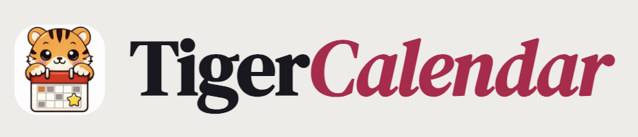
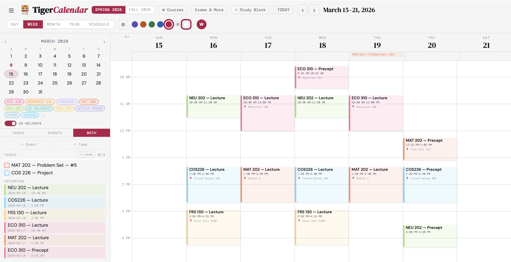
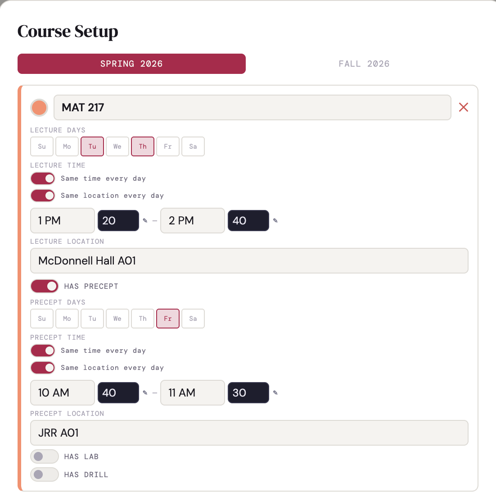
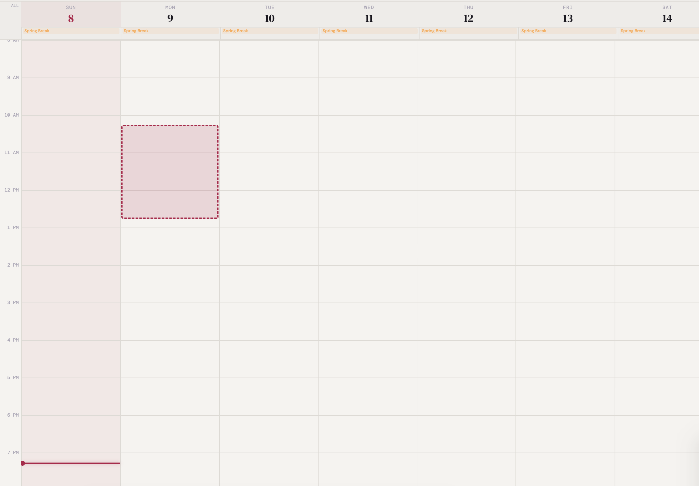
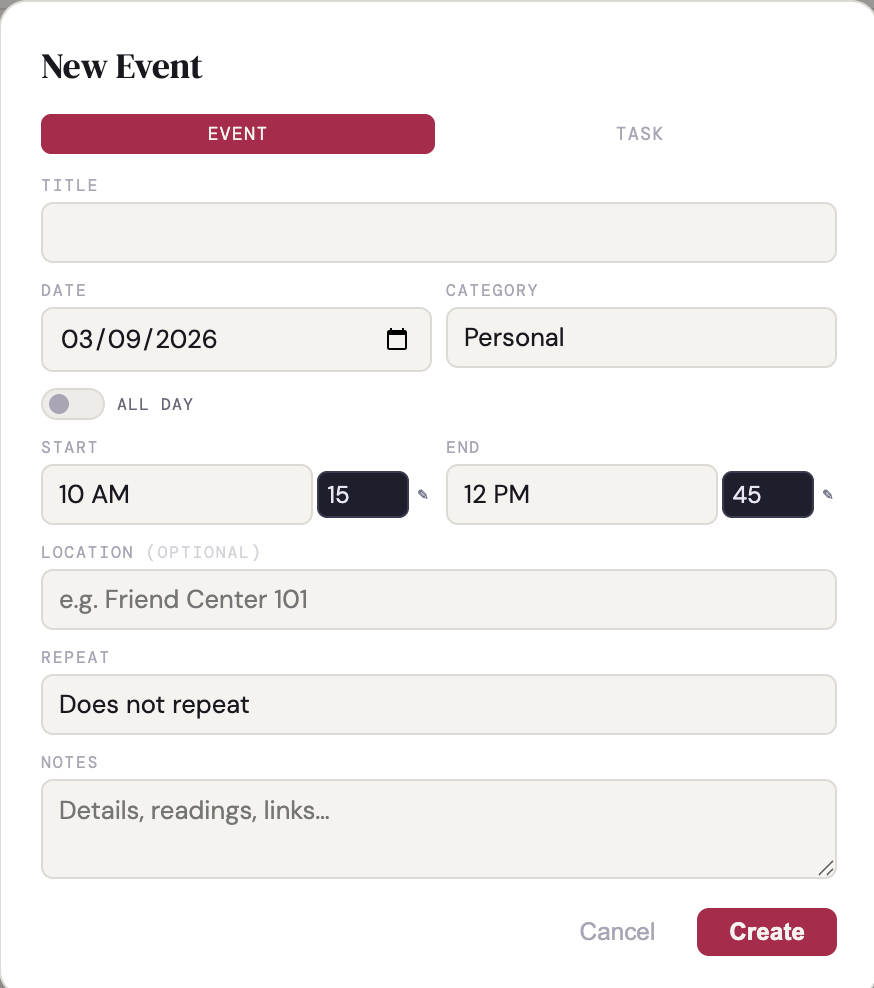
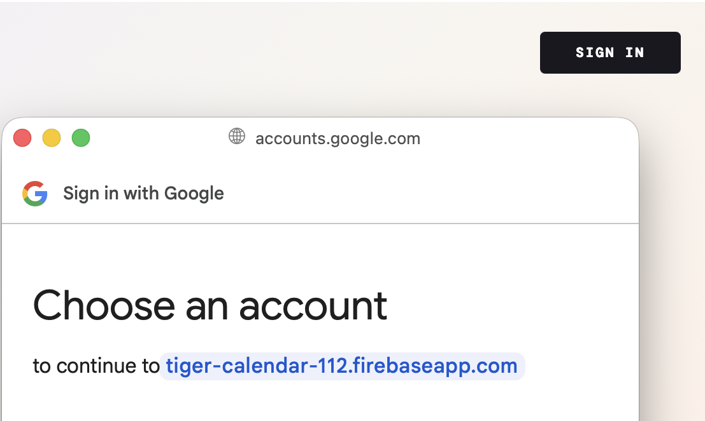

  

  

  <strong>The calendar app built for Princeton students — course scheduling, academic calendar, cloud sync, and more</strong>
   
  Free, ad-free, and made specifically for Princeton life

  <a href="https://lillianwang112.github.io/tiger-calendar/">🚀 Open App</a> •
  <a href="#%EF%B8%8F-quick-start-tldr">📖 Quick Start</a> •
  <a href="#-frequently-asked-questions">❓ FAQ</a>

  
  
  
  

---

Hey Everyone! 👋

I built TigerCalendar because Google Calendar doesn't know what a precept is, and iCal doesn't know when Spring Break starts. This is a full-featured calendar and task manager built *specifically* for Princeton students — with course setup, semester-aware scheduling, academic calendar overlays, cloud sync, and a time grid that actually works on your phone.

## 📋 Table of Contents
- [Quick Start](#%EF%B8%8F-quick-start-tldr)
- [Install as an App](#-install-as-an-app-pwa)
- [Export to Google Calendar & More](#-export-to-google-calendar-apple-calendar--more)
- [Features at a Glance](#-features-at-a-glance)
- [How to Use](#-how-to-use)
- [All Features](#-all-features)
- [Keyboard Shortcuts](#%EF%B8%8F-keyboard-shortcuts)
- [FAQ](#-frequently-asked-questions)
- [Tech](#-tech)
- [About This Project](#-about-this-project)

---

## ⚡️ Quick Start (TL;DR)
1. Visit **[lillianwang112.github.io/tiger-calendar](https://lillianwang112.github.io/tiger-calendar/)**
2. Click **"Courses"** to set up your semester schedule
3. Pick your semester (Spring 2026 or Fall 2026)
4. Add your courses with lecture, precept, lab, and drill times
5. Hit **"Save & Generate"** — your whole semester populates automatically 🎉

---

## 📱 Install as an App (PWA)

TigerCalendar is a Progressive Web App — install it on your phone or computer for a fullscreen native app experience, no App Store required.

**iPhone/iPad (Safari):**
1. Open the app in Safari
2. Tap the **Share** button (square with arrow)
3. Scroll down and tap **"Add to Home Screen"**
4. Toggle **"Open as Web App"** ON
5. Tap **Add** — launches fullscreen like a real app!

**Android (Chrome):**
1. Open the app in Chrome
2. Tap the **three-dot menu** → **"Add to Home Screen"** or **"Install App"**

**Desktop (Chrome/Edge):**
1. Look for the **install icon (⊕)** in the address bar
2. Click **"Install"**

Your data saves locally and syncs to the cloud if you sign in with Google — so you won't lose anything even after installing.

---

## 📤 Export to Google Calendar, Apple Calendar & More

Don't want to switch calendar apps? No problem.

TigerCalendar is also the fastest way to set up *any* calendar for the Princeton semester. Use the Course Wizard to enter all your courses in under 5 minutes — lectures, precepts, labs, drills, office hours, exams, and problem set deadlines — with Princeton's academic calendar (spring break, midterm week, finals) all pre-loaded and handled automatically. Then export everything as a standard `.ics` file and import it directly into Google Calendar, Apple Calendar, Outlook, or any other app.

**The workflow:**
1. Set up your full semester schedule in TigerCalendar (~5 min)
2. Go to **Settings → Export .ics**
3. Import the file into your calendar app of choice
4. Done — your entire semester is populated, breaks skipped, precepts included

> Google Calendar doesn't know what a precept is. TigerCalendar does.
> Set it up here, take it anywhere.

---

## ✨ Features at a Glance

| Feature | Description |
|---------|-------------|
| 📅 **5 Calendar Views** | Day, Week, Month, Year, Schedule |
| 🎓 **Course Wizard** | Add lectures, precepts, labs & drills with per-day time overrides |
| 🗓️ **Princeton Academic Calendar** | Breaks, midterm week, finals, and more — auto-loaded |
| 🔁 **Recurring Events** | Daily, weekly, monthly, annually, weekdays, or fully custom |
| 📋 **Relative Assignment Generator** | Auto-generate a full semester of pset deadlines tied to your course schedule |
| ✅ **Exams & Assignments Tracker** | Deadlines, problem sets, and exams per course — with relative auto-generation |
| 🗂️ **Syllabus View** | Auto-generated timeline of all lectures, precepts, labs, and drills per course |
| 📚 **Study Block Generator** | Quickly create recurring study sessions tied to a course |
| ☁️ **Google Cloud Sync** | Sign in to sync across all your devices in real time |
| 📱 **Mobile-Optimized** | Long-press-to-drag, pinch-to-zoom, swipe navigation |
| 💯 **100% Free** | No ads, no paywalls, no subscriptions |

---

## 🚀 How to Use

### Step 1: Open the App
Visit: **[lillianwang112.github.io/tiger-calendar](https://lillianwang112.github.io/tiger-calendar/)**

### Step 2: Set Up Your Courses

  

1. Click **"Courses"** in the top bar
2. Select your semester (Spring 2026 or Fall 2026)
3. For each course, enter:
   - Course name and color
   - Lecture days and times
   - Precept, lab, and drill sessions (if applicable)
   - Locations for each session type
4. Click **"Save & Generate"** — events are created for every class day of the semester, skipping breaks automatically

**Pro tip:** Use the "Same time every day" toggle if your precept time varies by day of week — you can set per-day overrides!

### Step 3: Auto-Generate Your Problem Set Deadlines

One of TigerCalendar's most powerful features: instead of entering each pset deadline manually, use the **Relative** tab in **Exams & More** to generate your entire semester's worth of assignments in one step.

1. Click **"Exams & More"** in the top bar and select your course
2. Go to the **Relative** tab
3. Set the anchor (e.g., "After each Lecture"), offset in days, due time, and title prefix
4. Enable auto-numbering (PSET 1, PSET 2, …) and hit **Preview →** to review
5. Confirm — every deadline for the semester is created instantly

### Step 4: Add Events & Tasks

  
  &nbsp;
  

  <em>Left: Click and drag to set duration &nbsp;|&nbsp; Right: Fill in event details</em>

**On desktop:**
- Click any empty time slot to create an event at that time
- Click and drag to set start and end time at once

**On mobile:**
- Tap any time slot for a quick preview, then tap again to create
- Long-press (hold 300ms) and drag to draw out a duration

**For tasks:** Use the task type to set a deadline without blocking off calendar time.

### Step 5: Sign In for Cloud Sync *(Optional)*

  

Click your profile area and sign in with Google to:
- Sync your calendar across your phone, tablet, and laptop
- Never lose your schedule if you clear your browser

### Step 6: Explore Views

Switch between views using the buttons at the top or keyboard shortcuts:
- **Week view** — the main workhorse; shows your full schedule at a glance
- **Month view** — great for planning ahead
- **Schedule view** — a linear list of upcoming events, perfect on mobile
- **Day view** — zoomed in on a single day
- **Year view** — bird's-eye view of the whole year

---

## ✨ All Features

<strong>📅 Calendar Views</strong>

 

- **Day** — full time grid for a single day
- **Week** — 7-column time grid with swipe navigation on mobile
- **Month** — traditional grid with color-coded event chips and task dots
- **Year** — compact overview of all 12 months at once, with event indicators
- **Schedule** — chronological list of upcoming events and tasks, perfect on mobile
- **Now line** — live red indicator showing the current time, updates every minute
- **Mini calendar** in sidebar for quick date jumping
- **Pinch-to-zoom** on the time grid to adjust hour height

<strong>🎓 Course & Academic Integration</strong>

 

- **Course setup wizard** — configure lectures, precepts, labs, and drills in one place
- **Per-day time overrides** — set different times for, say, Tuesday precept vs. Thursday precept
- **Semester selector** — Spring 2026 and Fall 2026 with all Princeton academic dates pre-loaded
- **Academic calendar overlay** — add/drop deadline, midterm week, spring break, finals, commencement, and more
- **US Holidays overlay** — toggle on/off independently
- **Auto-generation** — skips breaks and non-class days automatically when generating your schedule
- **Syllabus view** — after course setup, the Exams & More modal shows a full auto-generated timeline of every lecture, precept, lab, and drill session for the semester, with exact dates and locations

<strong>📝 Events & Tasks</strong>

 

- **All-day events** with multi-day span support
- **Recurring events** — daily, weekly (with specific days), monthly, annually, every weekday, or fully custom (every N days/weeks/months/years, with specific days-of-week and configurable end conditions: never, by date, or after N occurrences)
- **Location field** — shown inline on the time grid
- **Notes field** — for details, readings, or links
- **Tasks** — separate from events, with a due date and optional due time; overdue tasks are highlighted
- **Drag-to-reschedule** — move events by dragging on desktop
- **Click and drag to create** — drag across a time range to set start and end time at once
- **Undo** — Cmd/Ctrl+Z to undo any change

<strong>📊 Exams, Assignments & Office Hours Tracker</strong>

 

All accessible from the **Exams & More** button in the top bar, organized per course across five tabs:

- **Exams** — log quizzes, midterms, finals, oral exams, and practicals with date, time, location, and study notes
- **Assignments** — log individual problem sets and assignments with due date, due time (to the minute), tags, estimated hours, and details
- **Office Hours** — add recurring office hours with instructor/TA name, days of week, time, and location; automatically appear under the "Office Hours" sidebar category
- **Relative** — automatically generate a full assignment series tied to your course schedule (e.g., "Problem Set due 0 days after each Lecture at 11:59 PM"), with auto-numbering (PSET 1, PSET 2, …) and a live preview before committing — saves significant setup time at the start of the semester
- **Syllabus** — browse the complete auto-generated list of all course sessions (lectures, precepts, labs, drills) with dates and locations, as a quick reference

<strong>📚 Study Block Generator</strong>

 

- Quickly create recurring study sessions tied to a specific course
- Set a label (e.g., "Study"), choose days of the week, and set start/end times
- Appears on the calendar with the course's color for at-a-glance weekly planning

<strong>🗂️ Sidebar & Filtering</strong>

 

- **Upcoming panel** — scrollable list of events and tasks for the next few days, grouped by date
- **Category filtering** — toggle any category or course on/off to declutter your view; each course gets its own toggle chip
- **Time Insights** — total hours scheduled this week, broken down by course with named colored bars (e.g., MAT 217: 4.0h, COS 126: 4.0h)
- **Weekly load chart** — bar chart visualizing your event density by day of the week, broken down by type (Class, Exam, Work) to quickly spot busy vs. light days
- **Tasks panel** — toggle between Tasks, Events, or Both in the sidebar; tasks show completion state and undo support

<strong>☁️ Sync & Persistence</strong>

 

- **localStorage** — all data saved locally in your browser automatically, no sign-in required
- **Google account sync via Firebase** — sign in with Google to back up and sync across all your devices in real time; a "Syncing across devices" indicator confirms active sync in your account panel
- **Offline-capable** — works without an internet connection once the page has loaded (service worker caching)
- **Export/Import** — download your data as an `.ics` file (compatible with Google Calendar, Apple Calendar, and Outlook) or as JSON; import JSON back on any device

<strong>📱 Mobile & Touch</strong>

 

- **Swipe navigation** — swipe left/right in week/day view to move forward or back
- **Long-press-to-drag** — hold 300ms on an empty time slot, then drag to set duration (no accidental scroll triggers)
- **Tap-to-preview** — tap an empty slot to see a "New event" preview before committing
- **Pinch-to-zoom** — spread or pinch on the time grid to adjust hour height
- **FAB** — floating action button on mobile for quick event creation
- **Responsive sidebar** — collapses automatically on small screens
- **Install as PWA** — add to your home screen on iOS (Safari → Share → Add to Home Screen) or Android/Desktop (Chrome → Install App) for a fullscreen native app experience, no App Store required

<strong>🎨 Personalization</strong>

 

- **Theme accent colors** — choose from 5 accent colors (Purple, Orange, Green, Blue, Rose)
- **Light/Dark mode** — toggle between light and dark themes
- **Week start day** — Sunday or Monday
- **Color-coded courses** — each course gets a unique color automatically, fully customizable
- **Custom categories** — create your own beyond the built-ins (Personal, Other)
- **Time format** — 12-hour or 24-hour
- **Timezone** — configurable (defaults to America/New_York)

---

## ⌨️ Keyboard Shortcuts

| Key | Action |
|-----|--------|
| `D` | Day view |
| `W` | Week view |
| `M` | Month view |
| `Y` | Year view |
| `S` | Schedule view |
| `T` | Jump to today |
| `←` / `→` | Navigate forward / back |
| `N` | New event |
| `\` | Toggle sidebar |
| `Cmd/Ctrl + Z` | Undo last action |

---

## ❓ Frequently Asked Questions

### 🚀 Getting Started

<strong>Do I need to make an account?</strong>

 
Nope! TigerCalendar works fully without signing in — your data is saved automatically in your browser. Sign in with Google only if you want to sync across multiple devices.

<strong>Does this work on my phone?</strong>

 
Yes! It's fully touch-optimized with swipe navigation, long-press-to-drag, and pinch-to-zoom. Install it as a PWA for the best experience — it'll feel just like a native app.

<strong>Can I use this offline?</strong>

 
Yes! Once the page loads, the app works without an internet connection. A service worker caches everything locally.

<strong>Which semesters are supported?</strong>

 
Spring 2026 and Fall 2026 are built in, with all Princeton academic dates pre-loaded. More semesters will be added as they're announced.

### 📅 Courses & Events

<strong>How do I add a course with different precept times on different days?</strong>

 
In the course wizard, turn off the "Same time every day" toggle for the precept section. You'll be able to set a different time for each day of the week that precept meets.

<strong>How do I auto-generate all my problem set deadlines at once?</strong>

 
Go to <strong>Exams & More</strong>, select your course, and click the <strong>Relative</strong> tab. Set the anchor (e.g., "After each Lecture"), offset in days, due time, assignment type, and title prefix. Enable auto-numbering and hit <strong>Preview →</strong> to review before generating. This creates the full semester's worth of assignments in one step.

<strong>How do I edit or delete an event?</strong>

 
Click any event to open it. You'll see Edit and Delete buttons. For recurring events, you can delete just that occurrence or the whole series. Note: editing a single occurrence of a recurring event is not yet supported.

<strong>Can I add events that aren't courses?</strong>

 
Yes! Use the Personal or Other categories for non-course events, or create your own custom categories with any color.

<strong>Can I see my tasks alongside my events?</strong>

 
Yes. Tasks with due dates appear in the all-day row in week/day view and in the sidebar upcoming panel. Overdue tasks are highlighted.

### ☁️ Sync & Data

<strong>My data disappeared after I cleared my browser!</strong>

 
Data is stored in your browser's local storage by default. Clearing browser data will erase it. To prevent this, sign in with Google for cloud backup — or use Export in Settings to download a JSON copy of your data regularly.

<strong>Can I use TigerCalendar on my laptop and phone at the same time?</strong>

 
Yes, if you sign in with the same Google account on both devices. Changes sync in real time via Firebase, and the Account panel will show a "Syncing across devices" confirmation.

<strong>Can I export my calendar to Google Calendar or Apple Calendar?</strong>

 
Yes! Go to Settings → Export .ics to download a standard iCalendar file you can import into Google Calendar, Apple Calendar, Outlook, or any other calendar app.

---

## 🛠️ Tech

Zero build step. Single `index.html` — just open it in a browser.

- **React 18** via CDN — no npm, no bundler
- **Babel Standalone** — for in-browser JSX compilation
- **Firebase Auth & Firestore** — optional Google sign-in and real-time cloud sync
- **Google Fonts** — DM Serif Display, DM Mono, DM Sans
- **localStorage** — offline-first persistence
- **Service Worker** — PWA caching and offline support

---

## 🙏 About This Project

TigerCalendar was built by a Princeton student who got tired of manually entering every precept into Google Calendar and then manually blocking off spring break. It started as a weekend project and grew from there.

> **Note:** The app is still a work in progress and may have bugs. If you find any issues or have feature suggestions, please reach out at **lw3319@princeton.edu** — feedback genuinely helps!

The app is open source and free to use or adapt. If you find it useful, share it with your classmates!

**Good luck this semester. Go Tigers! 🐯**

---

## 🚧 Known Limitations & Future Ideas

<strong>Current Limitations</strong>

 

- **localStorage only (without sign-in)** — clearing browser data will erase local progress; sign in with Google or export regularly to be safe
- **No cross-device sync without Google sign-in** — data lives in the browser unless you're signed in
- **Recurring event edits** — editing a single occurrence of a recurring event isn't yet supported (only delete)
- **No push notifications** — no reminders for upcoming events yet

<strong>Possible Future Features (Maybe!)</strong>

 

- 🔔 Push notifications / reminders
- 📲 Two-way Google Calendar sync
- 🗺️ Campus map integration for locations
- 📊 Semester-level workload analytics
- 🤝 Share your schedule with friends

*Note: This is a student project maintained during the semester. Updates may be sporadic!*

---

*Perfect for: Course scheduling · Exam prep · Weekly planning · Staying on top of precepts*

*Made by Lillian Wang · Princeton University · Spring 2026*
